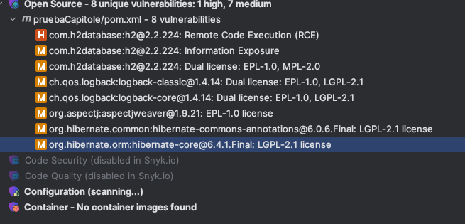

# Información Importante 
El siguiente repositorio está destinado para pruebas técnicas realizadas para Capitole y/o personas destinadas, el uso es confidencial.

## Dependencias generales

- Java 17
- Maven
- Docker

## Java 17

```
https://jdk.java.net/17/
```

```
Download (mac) 
https://www.oracle.com/cl/java/technologies/downloads/#java17```

```

```
Install (mac)
$ cd ~/Downloads $ tar xf openjdk-17.0.2_osx-x64_bin.tar.gz
```

Configure sudo mv jdk-17.0.2.jdk /Library/Java/JavaVirtualMachines/

```
## JAVA_HOME
```

Configurar variable de entorno (ruta en mac para jdk-17, puede variar en otros SO)

```
export JAVA_HOME=/Library/Java/JavaVirtualMachines/jdk-17.0.2.jdk/Contents/Home/
```


## Instalación MAVEN !OPCIONAL

macOS
```
brew install maven
```

generar Wrapper de Maven
```
mvn -N wrapper:wrapper

```
Este comando crea los siguientes archivos y directorios:
mvnw y mvnw.cmd: Scripts ejecutables para Unix/Mac y Windows, respectivamente.
.mvn/wrapper/: Un directorio que contiene el archivo maven-wrapper.jar y maven-wrapper.properties

Para configurar maven-wrapper.properties
dentro de .mvn/wrapper/maven-wrapper.properties se puede especificar la version de Maven que el wrapper debe descargar y usar.

Ejemplo:
```
distributionUrl=https://repo.maven.apache.org/maven2/org/apache/maven/apache-maven/3.9.6/apache-maven-3.9.6-bin.zip

```

Para la utilización se puede utilizar el siguiente comando:
```
./mvnw clean install

```

Se incorporan los siguientes archivos para garantizar que al momento de clonar repositorio se construya el proyecto sin necesidad de tener instalado Maven localmente.

```
mvnw
mvnw.cmd
.mvn/wrapper/maven-wrapper.jar
.mvn/wrapper/maven-wrapper.properties
```

### Clean Maven

`mvn clean`
### Compilación Maven

`mvn compile`
### Test Maven

`mvn test`

### Build Maven

`mvn package`

## Run 

`java -jar target/pruebaTec-0.0.1-SNAPSHOT.jar`


## Servicios entregados
### Server
Los recursos están disponibles en el puerto: 8080
para arrancar en otro puerto se puede modificar 
```
server:
  port: 8080

```
### Endpoints

Se entrega siguiente **endpoint**:

_Obtención de precio_ acorde a una cadena(**brandId**), producto(**productId**) y la fecha a consultar(**applicationDate**).
Como parametria de consulta se detalla a continuación:
* _brandId_: siendo un número __entero__ natural(Ejemplo: 1).
* _productId_: siendo un número __entero__ natural(Ejemplo: 35455).
* _applicationDate_: siendo una fecha seleccionada en formato __ISO 8601__(Ejemplo: 2020-06-14T19:00:59).
  - Formato detallado a continuación:
      * _2020-06-14_: La fecha está compuesta por año-mes-dia de la siguiente manera YYYY-MM-DD(2020-06-14)
      * _T_: El separador de tiempo, indicando el inicio del componente de hora.
      * _19:00:59_: La componente hora está compuesta por la hora(19), los minutos(00) y los segundos(59), todos separados por dos puntos(traducido a ascii como %3A).

Como respuesta tenemos internamente la identification que si existen 2 precios para una hora señalada se obtenga el que tiene una mayor prioridad, identificada en el campo __PRIORITY__, siendo el más lejano a 0 el de mayor prioridad

#### CURL V1

__Caso correcto__

Request
```
curl --location --request GET 'localhost:8080/prices?applicationDate=2020-06-14T19%3A00%3A59&productId=35455&brandId=1'
```
Respuesta
```
{
    "brandId": 1,
    "startDate": "2020-06-14 00:00:00",
    "endDate": "2020-12-31 23:59:59",
    "priceList": 1,
    "productId": 35455,
    "priority": 0,
    "price": "35,50",
    "curr": "EUR"
}
```
__Caso Error__

Request
```
curl --location --request GET 'localhost:8080/prices?applicationDate=2020-06-14T19%3A00%3A59&productId=35455&brandId=a'

```
Respuesta
```
An unexpected error occurred: Failed to convert value of type 'java.lang.String' to required type 'java.lang.Integer'; For input string: "a"
```
__Caso precio no encontrado__

Request
```
curl --location --request GET 'localhost:8080/prices?applicationDate=2020-06-14T19%3A00%3A59&productId=35455&brandId=2'
```
Respuesta
```
Price not found: Applicable price not found for productId: 35455, brandId: 2, and date: 2020-06-14T19:00:59
```

#### Curl cambio estructura

Se realiza modificación y estandarización de respuesta
modificación en test
```
    .andExpect(content().contentTypeCompatibleWith(MediaType.APPLICATION_JSON))
    .andExpect(content().string("Price not found: Applicable price not found for productId: 1, brandId: 2, and date: 2024-02-06T10:00"));

```
Se reemplaza por 
```
    .andExpect(content().contentTypeCompatibleWith(MediaType.APPLICATION_JSON))
    .andExpect(jsonPath("$.status").value(404))
    .andExpect(jsonPath("$.data").isEmpty())
    .andExpect(jsonPath("$.message").value("Price not found: Applicable price not found for productId: 1, brandId: 2, and date: 2024-02-06T10:00"));

```
En respuesta del servicio

correcta

```
{
    "status": 200,
    "message": "success",
    "data": {
        "priceList": 1,
        "brandId": 1,
        "startDate": "2020-06-14 00:00:00",
        "endDate": "2020-12-31 23:59:59",
        "productId": 35455,
        "priority": 0,
        "price": "35,50",
        "curr": "EUR"
    }
}
```

Correcta no encontrado
```
{
    "status": 404,
    "message": "Price not found: Applicable price not found for productId: 35455, brandId: 2, and date: 2020-06-14T19:00:59",
    "data": null
}
```

Error interno
```
{
    "status": 500,
    "message": "An unexpected error occurred: Failed to convert value of type 'java.lang.String' to required type 'java.lang.Integer'; For input string: \"a\"",
    "data": null
}
```
### Docker

Para generar build de docker podemos:
Generar build
```
docker build -t prueba-tec .
```
Arrancar contenedor
```
docker run -d --name prueba-tec-cont -p 8080:8080 prueba-tec
```
Detener contenedor
```
docker stop prueba-tec-cont
```
Analizar vulnerabilidades
```
docker scout quickview

```

### Reference Documentation

Vulnerabilidades conocidas y evaluadas con __Snyk.io__



